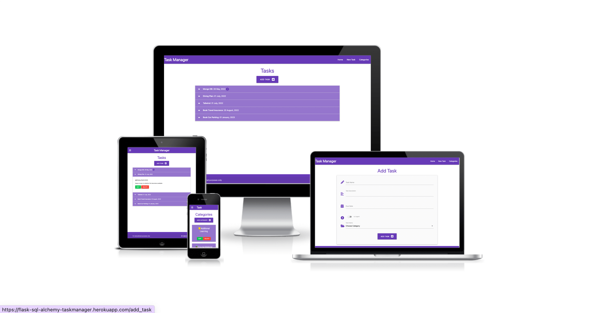
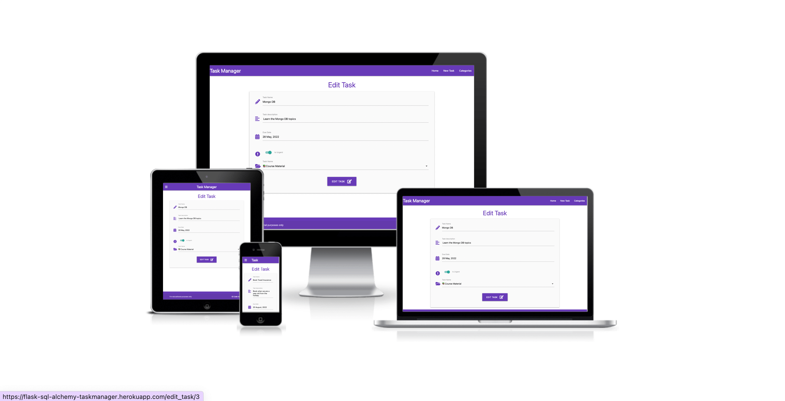
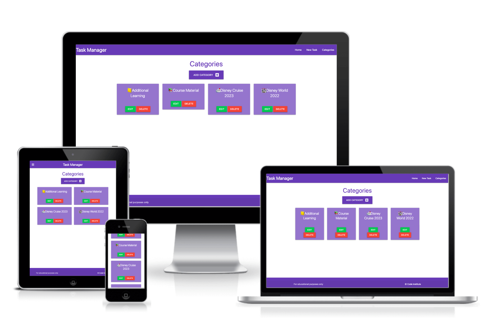

# Relational Databases Task Manager

A Relational Database Task Manager site created as a walkthrough project from Code Institute.

Users are able to create, view, edit and delete their tasks and categories.



Visit the live site here: [Relational Databases Task Manager](https://flask-sql-alchemy-taskmanager.herokuapp.com/)


- - -

## User Experience

### User Stories

#### First Time Visitor Goals

* As a first time user, I want the site to be easy to navigate.
* As a first time user, I want to be able to add categories to store my tasks in.
* As a first time user, I want to be able to save tasks I create in a category of my choice.

#### Returning Visitor Goals

* As a returning user, I want to be able to edit tasks.
* As a returning user, I want to be able to edit categories.

#### Frequent Visitor Goals

* As a frequent user, I want to be able to delete tasks I no longer want.
* As a frequent user, I want to be able to delete categories that I no longer need.

- - -

## Design

### Colour Scheme


I have used `#9575CD` and `#673AB7` as the main colour highlights for the site, used for the headers, footers, titles, task collapsibles and category cards.

`#000000` & `#FFFFFF` have been used for the text on the site and the background of the site and collapsible tasks.

`#F44336` & `#00C853` are used for the edit and delete buttons.

### Typography

I used the system fonts and didn't import any fonts for this project.

### Imagery

All icons on the site were sourced from Font Awesome.

### Wireframes

Wireframes were created for mobile, tablet and desktop using Balsamiq.

Wireframes links/images to go here

### Features

The website is comprised of 6 pages: The home page which displays all tasks, a categories page which displays all categories, an edit categories page which allows the user to edit a category, an edit task page which allows the user to edit a task, an add category page which allows userts to create a new category and an add task page which allows users to create a new task.

All Pages on the website have:

* A favicon. The favicon for the site was created at [Favicon.io](https://favicon.io/).
  * Font Title: Leckerli One
  * Font Author: Copyright (c) 2011 [Gesine Todt](www.gesine-todt.de), with Reserved Font Names "Leckerli"
  * [Font Source](http://fonts.gstatic.com/s/leckerlione/v16/V8mCoQH8VCsNttEnxnGQ-1itLZxcBtItFw.ttf)
  * [Font License: SIL Open Font License, 1.1](http://scripts.sil.org/OFL))

  
  

* A navbar. The navbar contains links to the home, new tasks and categories pages. The navbar is responsive and on smaller devices uses the hamburger icon. When this is clicked the menu opens to the left of the screen.


* A footer. The footer contains a copyright message and states that the site is for educational purposes. The footer is fully responsive.


- - -

`Home Page`


`Add Task Page`


`Edit Task Page`



`Categories Page`



`Add Category Page`


`Edit Category Page`


- - -

Future Implementations.

* Login functionality
* Defensive programming - I would like to add a modal that pops up when a user wants to delete a task or category, as an extra layer of security to confirm the user wants to delete and to let them know that this action is permanent and cannot be undone.
* User authentication - This could then be tied into the defensive programming by ensuring the person deleting task/category is the same person who created the task/category.
* 404 Error Page
* Colour Scheme - ensure that the contrast is sufficient to pass checks.

### Accessibility

I have been mindful during coding to ensure that the website is as accessible friendly as possible. This has been have achieved by:

* Using semantic HTML.
* Using descriptive alt attributes on images on the site.
* Providing information for screen readers where there are icons used and no text.
* I am aware from the Lighthouse testing that the current colour scheme is not meeting some contrast requirements. This will be ammended in a future release.

- - -

## Technologies Used

### Languages Used

HTML, CSS, Python

### Frameworks, Libraries & Programs Used

Balsamiq - Used to create wireframes.

Git - For version control.

Github - To save and store the files for the website.

[Flask-SLQAlchemy](https://pypi.org/project/Flask-SQLAlchemy/)

[psycopg2](https://pypi.org/project/psycopg2/)

[Jinja](https://jinja.palletsprojects.com/en/3.1.x/) - used for templating

[Materialize](https://materializecss.com/) - Version 1.0.0 - For the frontend framework

[Font Awesome](https://fontawesome.com/v5/search)- Version 5.15.3 - For the iconography on the website.

Google Dev Tools - To troubleshoot and test features, solve issues with responsiveness and styling.

[Tiny PNG](https://tinypng.com/) To compress images used in the readme file.

[Favicon.io](https://favicon.io/) To create favicon.

[Am I Responsive?](http://ami.responsivedesign.is/) To show the website image on a range of devices.

[Shields.io](https://shields.io/) To add badges to the README

- - -

## Deployment & Local Development

### Deployment

The site is deployed using Heroku. To deploy the site using Heroku:

1. Create a new app with the name: flask-sql-alchemy-taskmanager.
2. Linked the flask-sql-alchemy-taskmanager app to the Github repository.
3. Verify that the project has an up to date Procfile and requirements.txt
4. Push the project to the Heroku remote.
5. Set the SECRET_KEY environmental variable in the Heroku config vars.

    | KEY | VALUE |
    | :-- | :-- |
    | IP | 0.0.0.0 |
    | PORT | 5000 |
    | SECRET_KEY| YOUR_SECRET_KEY`*` |
    | DATABASE_URL | postgres database url`*` |
    | MONGO_DBNAME | MONGO_DB`*` |
    | DEBUG | TRUE`**` |

`*` Denotes a value that is specific to your app.

`**` This is set to true while deploying to enable us to see any bugs. Please change to FALSE after deployment.

6. Set the IP to 0.0.0.0 and the PORT to 5000 in the Heroku config vars.
7. Set the DATABASE_URL environmental variable in the Heroku config vars.
8. Restart all dynos.
9. Open the app on Heroku and check to ensure that it's working correctly.

### Local Development

#### How to Fork

To fork the repository:

1. Log in (or sign up) to Github.
2. Go to the repository for this project, [sqlalchemy-flask-task-manager](https://github.com/kera-cudmore/sqlalchemy-flask-task-manager).
3. Click the Fork button in the top right corner.

#### How to Clone

To clone the repository:

1. Log in (or sign up) to GitHub.
2. Go to the repository for this project, [sqlalchemy-flask-task-manager](https://github.com/kera-cudmore/sqlalchemy-flask-task-manager).
3. Click on the code button, select whether you would like to clone with HTTPS, SSH or GitHub CLI and copy the link shown.
4. Open the terminal in your code editor and change the current working directory to the location you want to use for the cloned directory.
5. Type 'git clone' into the terminal and then paste the link you copied in step 3. Press enter.

#### How to run the project Locally

Once you have cloned the project locally, created a virtual environment and installed the requirements, you can run the project locally with the following command:

```bash
python3 run.py
```

- - -

## Testing

Testing was ongoing throughout the entire build. Please visit [TESTING.md](TESTING.md) for all testing carried out.

## Credits

### Code Used

This project was created as part of a walkthrough project for the Level 5 Diploma in Web Application Development with the Code Institute.
