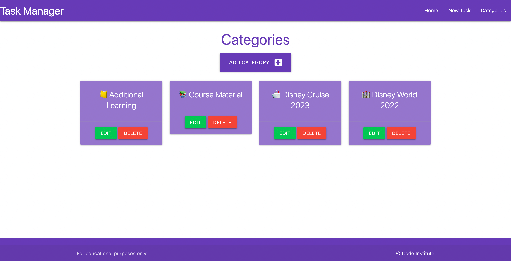
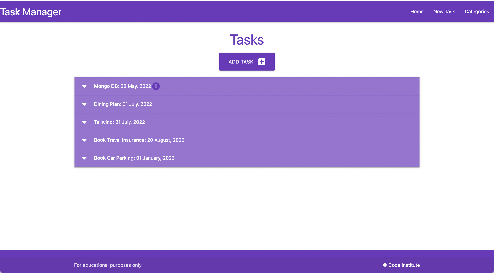
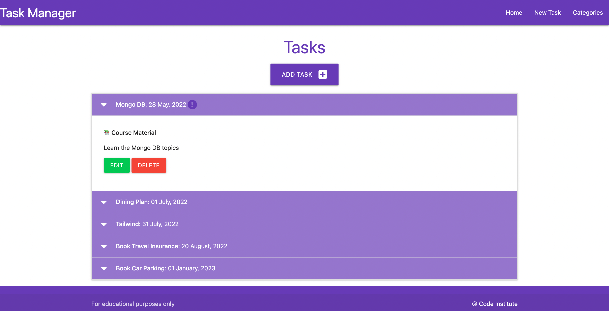

# Relational Databases Task Manager - Testing

responsive image of site to go here

Visit the deployed site: deployed site link to go here

- - -

## CONTENTS

* [AUTOMATED TESTING](#AUTOMATED-TESTING)
  * [W3C Validator](#W3C-Validator)
  * [JavaScript Validator](#JavaScript-Validator)
  * [Python Validator](#Python-Validator)
  * [Lighthouse](#Lighthouse)
* [MANUAL TESTING](#MANUAL-TESTING)
  * [Testing User Stories](#Testing-User-Stories)
  * [Full Testing](#Full-Testing)
* [Bugs](#Bugs)
  * [Known Bugs](#Known-Bugs)
  * [Solved Bugs](#Solved-Bugs)

Testing was ongoing throughout the entire build. I utilised Chrome developer tools whilst building to pinpoint and troubleshoot any issues as I went along.

During development I made use of google developer tools to ensure everything was working correctly and to assist with troubleshooting when things were not working as expected.

I have gone through each page using google chrome developer tools & Firefox inspector tool to ensure that each page is responsive on a variety of different screen sizes and devices.

- - -

## AUTOMATED TESTING

### W3C Validator

[W3C](https://validator.w3.org/) was used to validate the HTML on all pages of the website. It was also used to validate the CSS.

* [tasks.html](documentation/validation/tasks.png) - Passed
* [edit_task.html](documentation/validation/edit-task.png) - This is showing one error, The select element cannot have more than one selected option descendant unless the multiple attribute is specified. I will need to research this issue, and check the materialize documentation.
* [add_task.html](documentation/validation/add-task.png) - Passed
* [categories.html](documentation/validation/categories.png) - Passed
* [edit_category.html](documentation/validation/edit_cat.png) - Passed
* [add_category.html](documentation/validation/add_cat.png) - Passed
* [CSS](documentation/validation/css.png) - Passed

- - -

### JavaScript Validator

JavaScript files were validated using JShint.

* [script.js](documentation/validation/js.png)

- - -

### Python Validator

Put information about the python validator here - Pep8

* [__init__.py](documentation/validation/__init__validation.png) - one error displaying for module not being imported at the top of the file, however as the routes file relies on both the app and db variables they must be defined above where the routes are imported. If we tried to import the routes before defining the app and db variables we would get circular import errors
* [models.py](documentation/validation/models-validation.png) - No Errors
* [routes.py](documentation/validation/routes-validation.png) - The errors are for no whitespace around mathmatical operators. I have not added the whitespaces as on investigation this rule is not unanimously accepted.

- - -

### Lighthouse

I used Lighthouse within the Chrome Developer Tools to test the performance, accessibility, best practices and SEO of the website.

Lighthouse testing has flagged an issue with the colour scheme of the website - the contrast is not meeting requirements. This will be updated in a future release.

### Desktop Results

* [tasks.html Lighouse Desktop Testing](documentation/lighthouse/home-lh-desk.png)
* [edit_task.html Lighouse Desktop Testing]()
* [add_task.html Lighouse Desktop Testing]()
* [categories.html Lighouse Desktop Testing]()
* [edit_category.html Lighouse Desktop Testing]()
* [add_category.html Lighouse Desktop Testing]()

### Mobile Results

* [tasks.html Lighouse Mobile Testing](documentation/lighthouse/home-lh-mobile.png)
* [edit_task.html Lighouse Mobile Testing]()
* [add_task.html Lighouse Mobile Testing]()
* [categories.html Lighouse Mobile Testing]()
* [edit_category.html Lighouse Mobile Testing]()
* [add_category.html Lighouse Mobile Testing]()

- - -

## MANUAL TESTING

### Testing User Stories

`First Time Visitors`

| Goals | How are they achieved? | Evidence |
| :--- | :--- | :--- |
| As a first time user, I want the site to be easy to navigate.| The site features a navbar which allows the user to easily navigate through the site |   |
| As a first time user, I want to be able to add categories to store my tasks in. | When the user navigates to the categories page they are given the option to create a new category |  |
| As a first time user, I want to be able to save tasks I create in a category of my choice. | The user is given the option to create a new task from the home page |  |

`Returning Visitors`

|  Goals | How are they achieved? | Evidence |
| :--- | :--- | :--- |
| As a returning user, I want to be able to edit tasks. | When the user expands a task, they are given the option via button to edit the task. |  |
| As a returning user, I want to be able to edit categories. | When the user visits the categories page, they are given the option via button on each category card to edit the category |  |

`Frequent Visitors`

| Goals | How are they achieved? | Evidence |
| :--- | :--- | :--- |
| As a frequent user, I want to be able to delete tasks I no longer want. | When the user expands a task, they are given the option via button to delete the task |  |
| As a frequent user, I want to be able to delete categories that I no longer need. | When the user visits the categories page, they are given the option via button on each category card to delete the category |  |

- - -

### Full Testing

Full testing was performed on the following devices:

* Laptop:
  * Macbook Pro 2021 14 inch screen
* Mobile Devices:
  * iPhone 13 pro.
  * iPhone 11 pro.
  * Phone X.

Each device tested the site using the following browsers:

* Google Chrome
* Safari
* Firefox

Additional testing was taken by friends and family on a variety of devices and screen sizes. They reported no issues when playing.

| Feature | Expected Outcome | Testing Performed | Result | Pass/Fail |
| --- | --- | --- | --- | --- |
| `Navbar` |
| Navbar - Task Manager Site Name | Reloads the home page | Clicked site name | Home page reloads | Pass |
| Navbar - Home | Reloads the home page | Clicked home link | Home page reloads | Pass |
| Navbar - New Task | Loads the add task page | Clicked New Task link | Add task page loads | Pass |
| Navbar - Categories | Loads the categories page | Clicked Categories link | Categories page loads | Pass |
| `Home Page` |
| Add task button | Redirects to the add task page | Click button | Redirected to the add task page | Pass |
| Task drop down - to open | When clicked the task dropdown opens to display the task information | Click the task dropdown | Task dropdown opens | Pass |
| Task drop down - to close | When clicked the task dropdown closes to only display the task name and due date | Click the task dropdown | Task dropdown closes | Pass |
| Task Edit Button | When clicked the edit task page is opened with the task to be edited prepopulated | Click edit buton | Edit task page opens with the task information prepopulated | Pass |
| Task Delete button | When clicked the task is deleted | Click delete button | Task deleted from the list | Pass |
| `Add Task Page` |
| Add task button - form not filled out | Tooltips to be displayed to show site user what information is required to be filled in before submission | Click add task button with the form empty | Tooltip displays showing the user they need to fill in a field | Pass |
| Add task button - form filled out | User redirected to the home page with the task created in the list | Filled in form and clicked add task button | Redirected to the home page. Task created is in the list | Pass |
| `Edit Task Page` |
| --- | --- | --- | --- | --- |
| Submit button - task edited | User redirected to home page and the task edited has been updated | Changed a task and clicked edit task button | Page didn't reload to home. When home page loaded the task has been updated | FAIL - (Check routes) |
| `Categories Page` |
| --- | --- | --- | --- | --- |
| Add Category Button | When clicked the user is redirected to the add category page | Clicked add category button | Add category page opens | Pass |
| Category Card Edit Button | When clicked the user is redirected to the edit category page with the category name prepopulated | Clicked the edit button | Edit category page is opened | Pass |
| Category Card Delete Category Button | When clicked the category is deleted | Clicked delete button | The category card is removed from the categories page | Pass |
| `Add Category Page` |
| Add Category Button - category name empty | The user will be shown a tooltip showing them the category field needs to be completed | Clicked add category button with no category name filled in | tooltip displayed asing user to fill in category name field | Pass |
| Add Category Button - category name selected | User is redirected to the categories page and the new category card is displayed |  | Created a category name and clicked add category | Pass |
| `Edit Category Page` |
| Edit Category button | when clicked the user is redirected to the categories page and the category name has been updated | Updated category name and clicked edit category button | Redirected to categories page and the category name was updated | Pass |
| `Footer` |
| Footer - Code Institute Link | Opens in a new tab the Code Institute website | Click link | Code Institute site opened in a new browser tab | Pass |

- - -

## Bugs

### Known Bugs

| Known Bug No | Bug Issue | Plan to Resolve |
| 1 | Contrast on the site is not suffient to pass contrast checks | Adjust the colour scheme of the site to ensure colour contrast is sufficient |
| 2 | Edit Task page is not redirecting to the home page | Check the routes for the edit task page |

### Solved Bugs

| Bug No | Bug Issue | How Resolved |
| :--- | :--- | :--- |

- - -

Back to [README.md](README.md)
